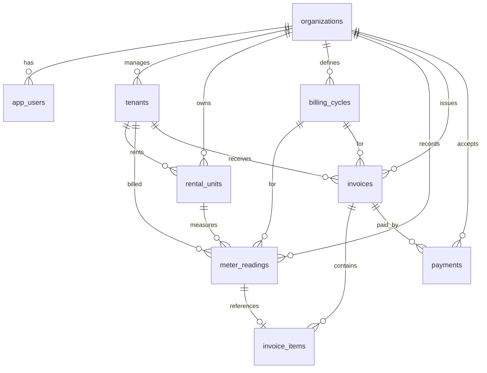

# 🗄️ Database Schema: โครงสร้างฐานข้อมูล

ข้อมูลในระบบถูกจัดเก็บและประมวลผลผ่านฐานข้อมูลเชิงสัมพันธ์ (Relational Database) บน Neon Postgres โดยควบคุมผ่าน Drizzle ORM ค่าเงินและค่าใช้จ่ายทั้งหมดจะถูกบันทึกในหน่วย **"สตางค์" (Satang - Integer)** เพื่อป้องกันปัญหาการปัดเศษผิดพลาดจากการใช้ทศนิยม (Floating Point Rounding Errors)

---

## 📊 ผังความสัมพันธ์ (Entity Relationship)

---

## ⚙️ Enums (รายการตัวเลือก)

### 1. `user_role` (สิทธิ์ผู้ใช้งาน)
*   `admin`: ผู้ดูแลระบบสูงสุด สามารถแก้ไขโครงสร้างและข้อมูลของหน่วยงานได้
*   `staff`: พนักงานทั่วไป บันทึกค่ามิเตอร์และรับชำระเงินได้

### 2. `tenant_status` (สถานะผู้เช่า)
*   `active`: กำลังเช่าอยู่และดำเนินธุรกรรมปกติ
*   `paused`: ระงับการเช่าชั่วคราว
*   `ended`: สิ้นสุดการเช่าแล้ว

### 3. `unit_status` (สถานะพื้นที่เช่า)
*   `occupied`: มีผู้เช่าใช้งานอยู่
*   `vacant`: ว่าง/พร้อมเช่า
*   `maintenance`: ปิดปรับปรุง/ซ่อมแซม

### 4. `cycle_status` (สถานะรอบบิล)
*   `draft`: อยู่ระหว่างรวบรวมข้อมูลมิเตอร์
*   `open`: เปิดให้เริ่มรับชำระเงินและออกใบแจ้งหนี้ได้
*   `closed`: ปิดรอบบิล สรุปงบการเงินแล้ว

### 5. `invoice_status` (สถานะใบแจ้งหนี้)
*   `draft`: ร่างใบแจ้งหนี้
*   `issued`: ออกใบแจ้งหนี้แล้ว รอชำระเงิน
*   `partial`: ชำระเงินบางส่วน
*   `paid`: ชำระเงินครบถ้วน
*   `overdue`: เกินกำหนดชำระ
*   `void`: ยกเลิกใบแจ้งหนี้

### 6. `invoice_type` (ประเภทค่าใช้จ่าย)
*   `rent`: ค่าเช่าพื้นที่
*   `electricity`: ค่าไฟฟ้า
*   `fuel_transport`: ค่าขนส่งน้ำมัน
*   `mixed`: ค่าเช่าและค่าไฟรวมกัน
*   `other`: อื่น ๆ (เช่น ค่าบริการ ค่าซ่อมแซม)

### 7. `payment_method` (ช่องทางการชำระเงิน)
*   `cash`: เงินสด
*   `bank_transfer`: โอนเงินผ่านบัญชีธนาคาร
*   `promptpay`: พร้อมเพย์ (PromptPay QR)
*   `other`: อื่น ๆ

---

## 📋 รายละเอียดตาราง (Table Definitions)

### 1. `organizations` (หน่วยงาน/ผู้ให้เช่า)
เก็บโปรไฟล์หลักสำหรับใส่ในส่วนหัวเอกสารใบแจ้งหนี้และใบเสร็จ
*   `id` (UUID, Primary Key)
*   `name` (text, Not Null) — ชื่อองค์กร
*   `tax_id` (text) — เลขประจำตัวผู้เสียภาษี
*   `address` (text) — ที่อยู่ในการออกใบเสร็จ
*   `phone` (text) — เบอร์โทรติดต่อ
*   `email` (text) — อีเมลติดต่อ
*   `vat_rate_basis_points` (integer, Default: 700) — อัตราภาษีมูลค่าเพิ่มคิดเป็น Basis Points (700 = 7.00%)
*   `vat_enabled_default` (boolean, Default: true) — เปิดใช้งานภาษีมูลค่าเพิ่มเป็นค่าเริ่มต้น

### 2. `tenants` (ผู้เช่า)
*   `id` (UUID, Primary Key)
*   `organization_id` (UUID, Foreign Key -> `organizations.id`)
*   `code` (text, Unique ในระดับองค์กร) — รหัสผู้เช่า (เช่น T001)
*   `name` (text, Not Null) — ชื่อผู้เช่า/บริษัทผู้เช่า
*   `contact_name` (text) — ชื่อผู้ติดต่อ
*   `tax_id` (text) — เลขผู้เสียภาษีของผู้เช่า
*   `phone` (text)
*   `email` (text)
*   `billing_address` (text) — ที่อยู่ในการจัดส่งเอกสารของผู้เช่า
*   `vat_enabled` (boolean, Default: true) — ผู้เช่ารายนี้คิดภาษีมูลค่าเพิ่มหรือไม่
*   `status` (tenant_status)

### 3. `rental_units` (ห้องเช่า/พื้นที่เช่า)
*   `id` (UUID, Primary Key)
*   `organization_id` (UUID, Foreign Key)
*   `tenant_id` (UUID, Foreign Key -> `tenants.id`, Set Null) — ผู้เช่าปัจจุบันที่ผูกอยู่กับพื้นที่นี้
*   `code` (text, Unique ในระดับองค์กร) — รหัสห้อง (เช่น Room 101)
*   `name` (text, Not Null) — ชื่ออธิบายพื้นที่เช่า
*   `rent_amount_satang` (integer) — อัตราค่าเช่าคงที่ (สตางค์)
*   `electric_rate_satang` (integer) — อัตราค่าไฟฟ้าต่อหน่วย (สตางค์)
*   `meter_serial` (text) — หมายเลขซีเรียลบนมิเตอร์
*   `status` (unit_status)

### 4. `billing_cycles` (รอบบิล)
*   `id` (UUID, Primary key)
*   `organization_id` (UUID, Foreign Key)
*   `label` (text, Unique ในระดับองค์กร) — ชื่อรอบบิล เช่น "พฤษภาคม 2569"
*   `period_start` (timestamp with timezone) — เริ่มต้นรอบบิล
*   `period_end` (timestamp with timezone) — สิ้นสุดรอบบิล
*   `due_date` (timestamp with timezone) — วันครบกำหนดชำระเริ่มต้น
*   `status` (cycle_status)

### 5. `meter_readings` (เลขอ่านมิเตอร์ไฟฟ้า)
*   `id` (UUID, Primary key)
*   `organization_id` (UUID, Foreign key)
*   `unit_id` (UUID, Foreign key -> `rental_units.id`) — พื้นที่เช่าที่ทำการวัด
*   `tenant_id` (UUID, Foreign key -> `tenants.id`) — ผู้เช่า ณ ขณะที่บันทึก
*   `billing_cycle_id` (UUID, Foreign key -> `billing_cycles.id`)
*   `previous_reading` (integer) — เลขมิเตอร์เก่า
*   `current_reading` (integer) — เลขมิเตอร์ใหม่
*   `usage_units` (integer) — จำนวนหน่วยที่ใช้จริง (`current_reading` - `previous_reading`)
*   `rate_satang` (integer) — เรทค่าไฟต่อหน่วย (สตางค์)
*   `amount_satang` (integer) — ยอดเงินค่าไฟก่อนภาษี (`usage_units` * `rate_satang`)
*   `cloudinary_public_id`, `cloudinary_asset_id`, `cloudinary_secure_url` (text) — ข้อมูลรูปถ่ายหลักฐานมิเตอร์ไฟฟ้าบน Cloudinary
*   `warning` (text) — ข้อความเตือนหากเลขอ่านมีความผิดปกติ (เช่น เลขลดลง หรือใช้ไฟมากเกินไป)

### 6. `invoices` (ใบแจ้งหนี้)
*   `id` (UUID, Primary key)
*   `organization_id` (UUID, Foreign Key)
*   `tenant_id` (UUID, Foreign Key -> `tenants.id`)
*   `billing_cycle_id` (UUID, Foreign key -> `billing_cycles.id`)
*   `invoice_no` (text, Unique ในระดับองค์กร) — เลขที่ใบแจ้งหนี้ เช่น INV-256905001
*   `type` (invoice_type) — ประเภทใบแจ้งหนี้
*   `issue_date` (timestamp) — วันที่ออกเอกสาร
*   `due_date` (timestamp) — วันครบกำหนดชำระเงิน
*   `subtotal_satang` (integer) — ผลรวมก่อนหักส่วนลดและภาษี (สตางค์)
*   `discount_satang` (integer) — ส่วนลด (สตางค์)
*   `vat_rate_basis_points` (integer) — อัตรา VAT ณ เวลาออกเอกสาร (เช่น 700 = 7.00%)
*   `vat_enabled` (boolean) — เปิดใช้งานคำนวณ VAT หรือไม่
*   `vat_amount_satang` (integer) — จำนวนภาษีมูลค่าเพิ่ม (สตางค์)
*   `total_satang` (integer) — ยอดเงินรวมทั้งสิ้นหลังหักส่วนลดและบวกภาษีแล้ว
*   `paid_satang` (integer) — จำนวนเงินที่ชำระไปแล้ว
*   `balance_satang` (integer) — ยอดคงเหลือค้างชำระ (`total_satang` - `paid_satang`)
*   `status` (invoice_status)
*   `notes` (text) — หมายเหตุของเอกสาร

### 7. `invoice_items` (รายการย่อยในใบแจ้งหนี้)
*   `id` (UUID, Primary key)
*   `invoice_id` (UUID, Foreign key -> `invoices.id`)
*   `meter_reading_id` (UUID, Foreign key -> `meter_readings.id`, Set Null) — ลิงก์ไปยังข้อมูลมิเตอร์กรณีเป็นค่าไฟ
*   `type` (invoice_type) — ประเภทรายการย่อย
*   `description` (text) — คำอธิบายรายการ
*   `quantity` (integer) — จำนวนชิ้น/จำนวนหน่วย
*   `unit_price_satang` (integer) — ราคาต่อหน่วย (สตางค์)
*   `amount_satang` (integer) — ยอดรวมรายการนี้ (`quantity` * `unit_price_satang`)

### 8. `payments` (รายการชำระเงิน/ใบเสร็จ)
*   `id` (UUID, Primary key)
*   `organization_id` (UUID, Foreign Key)
*   `invoice_id` (UUID, Foreign Key -> `invoices.id`) — ใบแจ้งหนี้ที่ทำการชำระเงินเข้า
*   `receipt_no` (text, Unique ในระดับองค์กร) — เลขที่ใบเสร็จรับเงิน เช่น RCPT-256905001
*   `paid_at` (timestamp) — วันเวลาที่ชำระจริง
*   `amount_satang` (integer) — จำนวนเงินที่ชำระเข้ามาในครั้งนี้
*   `method` (payment_method) — ช่องทางการจ่ายเงิน
*   `reference` (text) — อ้างอิง เช่น เลขที่สลิปโอนเงิน หรือหมายเลขธุรกรรมธนาคาร
*   `notes` (text)
*   `created_by_user_id` (UUID, Foreign Key -> `app_users.id`) — ผู้บันทึกการชำระเงิน

---
กลับไปหน้าหลัก: [[Index]]
