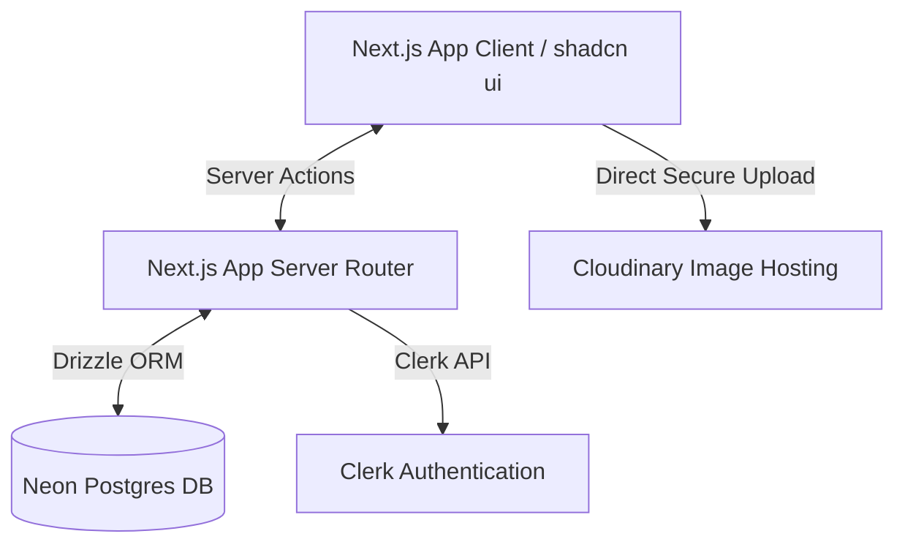

# 📊 Project Dashboard: ภาพรวมโปรเจค

โปรเจคนี้คือ **ระบบจัดการและออกใบแจ้งหนี้ค่าเช่าและค่าไฟ (Rental & Utility Billing System)** สำหรับบริหารจัดการผู้เช่าอาคาร/ห้องเช่า บันทึกเลขอ่านมิเตอร์ไฟฟ้าพร้อมรูปถ่ายยืนยัน คำนวณค่าไฟ ออกใบแจ้งหนี้ และออกใบเสร็จรับเงินเมื่อมีการชำระเงิน

---

## 🛠️ Tech Stack & Architecture

ระบบพัฒนาขึ้นโดยใช้เทคโนโลยีสมัยใหม่ เพื่อประสิทธิภาพการทำงานและความเสถียร:

*   **Frontend**: Next.js 16 (App Router), React 19, Tailwind CSS v4, Lucide Icons, shadcn/ui, Geist Sans & Noto Sans Thai Fonts.
*   **Database**: Neon Serverless Postgres, Drizzle ORM & Drizzle Kit สำหรับการย้ายฐานข้อมูล (Migrations).
*   **Authentication**: Clerk (สำหรับระบบจัดการสิทธิ์ของแอดมินและพนักงาน).
*   **Image Storage**: Cloudinary (สำหรับเก็บรูปถ่ายมิเตอร์ไฟฟ้าแบบ Signed Upload).
*   **Print Service**: Browser Print (ออกแบบใบแจ้งหนี้/ใบเสร็จสไตล์เอกสารการค้า รองรับการพิมพ์หรือเซฟ PDF ขนาด A4).

---

## 📂 โครงสร้างโฟลเดอร์หลัก (Key Folder Structure)

*   `src/app/` — โครงสร้าง Routing ของ Next.js
    *   `src/app/page.tsx` — หน้าแดชบอร์ดหลัก (Dashboard Workspace)
    *   `src/app/actions.ts` — Server Actions จัดการ Logic ฐานข้อมูลทั้งหมด (CRUD)
    *   `src/app/api/` — API Routes (เช่น การลงลายเซ็นอัปโหลด Cloudinary, การอ่านรูปมิเตอร์)
    *   `src/app/print/` — หน้ารูปแบบพิมพ์ใบแจ้งหนี้ (`/print/invoice/[id]`) และใบเสร็จ (`/print/receipt/[id]`)
*   `src/components/` — UI Components ต่าง ๆ
    *   `src/components/billing-workspace.tsx` — หน้าแดชบอร์ดหลักที่รวมการทำงานและ State ทั้งหมดไว้ในหน้าเดียว
*   `src/db/` — จัดการ Database Schema และการเชื่อมต่อ
    *   `src/db/schema.ts` — โครงสร้างตารางฐานข้อมูลและ enum ทั้งหมด
*   `src/lib/` — ฟังก์ชันยูทิลิตี้และโค้ดคำนวณเงิน/ภาษี
    *   `src/lib/billing.ts` — ตัวคำนวณหน่วยไฟ, ภาษีมูลค่าเพิ่ม (VAT), เลขรันนิ่งเอกสาร (Running Number)

---

## 🌟 ฟีเจอร์เด่นของระบบ (Core Features)

1.  **Dashboard แบบ All-in-One**: จัดการผู้เช่า พื้นที่เช่า มิเตอร์ ใบแจ้งหนี้ และประวัติการจ่ายเงินได้จากหน้าจอเดียวอย่างรวดเร็ว
2.  **บันทึกมิเตอร์พร้อมหลักฐาน**: มีระบบอัปโหลดรูปถ่ายเลขอ่านมิเตอร์ไปยัง Cloudinary เพื่อป้องกันข้อพิพาทเรื่องการคำนวณค่าไฟ
3.  **ระบบเตือนเลขอ่านมิเตอร์ผิดปกติ**: หากค่ามิเตอร์ที่ระบุมีค่าน้อยกว่าเดิม หรือมีอัตราการใช้ไฟสูงเกินค่าปกติ ระบบจะสร้าง Warning เตือนผู้บันทึกทันที
4.  **คำนวณค่าไฟและสร้างใบแจ้งหนี้อัตโนมัติ**: สามารถเลือกให้ออกใบแจ้งหนี้ค่าไฟอัตโนมัติทันทีที่กดบันทึกมิเตอร์
5.  **รองรับระบบภาษี (VAT) และส่วนลด**: จัดการคำนวณในระดับเศษสตางค์ (Satang) เพื่อป้องกันเลขอีเรอร์จากการคำนวณทศนิยม (Floating Point Error)
6.  **ระบบออกใบเสร็จรับเงิน**: พัฒนาระบบออกใบเสร็จรับเงินแยกรายธุรกรรม ป้องกันการชำระเงินซ้ำซ้อน
7.  **โหมด Demo ทำงานได้โดยไม่ต้องตั้งค่า**: หากยังไม่ได้เชื่อมต่อฐานข้อมูล Neon หรือ API อื่น ๆ ระบบจะปรับเข้าสู่โหมด Demo เสมือนจริงโดยใช้ State ภายในหน้าเว็บ

---
กลับไปหน้าหลัก: [[Index]]
